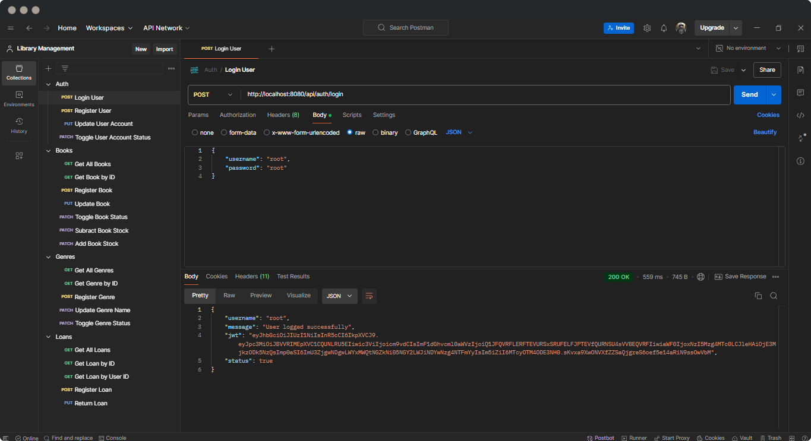

# Library Management System API


 

A **Library Management System API** built using **Java Spring Boot** and **MySQL**. This system allows both **administrators** and **customers** to manage a library's catalog, users, and book loans efficiently.

## Features ✨

### Administrator Features (1️⃣)
- **Manage Books**: List, search, register, edit, and deactivate books.
- **Manage Genres**: List, search, register, edit, and deactivate genres.
- **Manage Loans**: List and search loans, control book availability based on stock.

### Customer Features (2️⃣)
- **User Registration**: Customers can create their accounts.
- **Search Books**: Customers can browse and search for books available in the library.
- **Request Loans**: Customers can request loans for available books.
- **Update Account**: Edit account information.
- **Delete Account**: Permanently remove their account.

---

### Security Features 🔐
- **Role and Permission Management**: The system uses `Role` and `Permission` entities to handle user roles (e.g., **admin**, **customer**) and permissions for controlling the resources.
- **JWT Authentication**: Implemented **JSON Web Token (JWT)** authentication for secure login, ensuring that only authenticated users with with the appropriate roles can access certain endpoints.
- **Spring Security**: The system integrates **Spring Security** to protect the API, managing role-based access control to different resources and operations.

---

## Technologies Used 🚀

- **Java** with **Spring Boot** for backend API development.
- **MySQL** for database management.
- **Maven** for dependency management.
- **JPA (Java Persistence API)** for database interaction.
- **JWT** for secure authentication.
- **Spring Security** for role-based authorization.
- **RESTful Services** for communication between frontend and backend.

--- 

## Getting Started 🛠️

### Prerequisites

Make sure you have the following installed:

- [JDK 17](https://www.oracle.com/java/technologies/javase/jdk17-archive-downloads.html)
- [Maven](https://maven.apache.org/install.html)
- [MySQL](https://www.mysql.com/downloads/)

### Installation

1. Clone the repository:

   ```bash
   git clone https://github.com/blandoncj/library-management-api.git
   ```

2. Navigate to the project directory:

   ```bash
   cd library-management-api
   ```

3. Set up the MySQL database:

   - Create a MySQL database named `library_db` or as specified in `application.properties`.
   - Update the MySQL connection credentials in `src/main/resources/application.properties`:
  
     ```properties
     spring.datasource.url=jdbc:mysql://localhost:3306/library_db
     spring.datasource.username=your-username
     spring.datasource.password=your-password
     spring.datasource.driver-class-name=com.mysql.cj.jdbc.Driver
     spring.jpa.hibernate.ddl-auto=create
     spring.jpa.properties.hibernate.format_sql=true
     spring.jpa.show-sql=true
     security.jwt.key.private=your-secret-key
     security.jwt.user.generator=your-user-generator
     ```

4. Install dependencies and build the project using Maven:

   ```bash
   mvn clean install
   ```

5. Run the application:

   ```bash
   mvn spring-boot:run
   ```

--- 

## Database Schema 🗂️

The system uses a **relational database (MySQL)** with the following main entities:

- **Book**: Represents a book in the library.
- **Genre**: Represents the genre of a book.
- **User**: Represents a user of the library.
- **Loan**: Represents a book loan requested by a customer.
- **Role**: Represents the role of a user (e.g., Admin, Customer).
- **Permission**: Represents specific permissions that can be assigned to roles.
---

## Future Improvements 🚧

Here are some future enhancements planned for the system: 

- Implement **unit tests** and **integration tests** for the API.
- Improve the **pagination** in listing endpoints.
- Deploy the API on a cloud service (e.g., Heroku or AWS).

---

## Contribution Guidelines 🤝

Contributions are welcome! If you'd like to help improve this project, please follow these steps:

1. Fork the repository.
2. Create a new branch (`git chekout -b feature/new-feature`).
3. Commit your changes (`git commit -m 'Add a new feature'`).
4. Push to the branch (`git push origin feature/new-feature`).
5. Open a pull request.

---

## License 📝

This project is licensed under the MIT License. See the [LICENSE](LICENSE) file for details.

---

## Contact 📧

For any questions or feedback, feel free to reach out at:

- **Email**: jacoboblandon94@gmail.com
- **GitHub**: [blandoncj](https://github.com/blandoncj)

---

**Enjoy managing your library! 📚**
